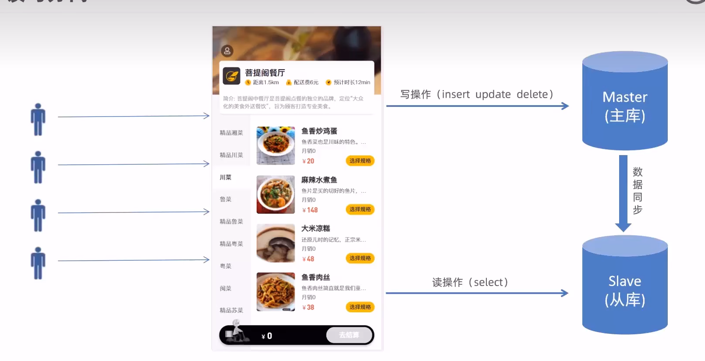
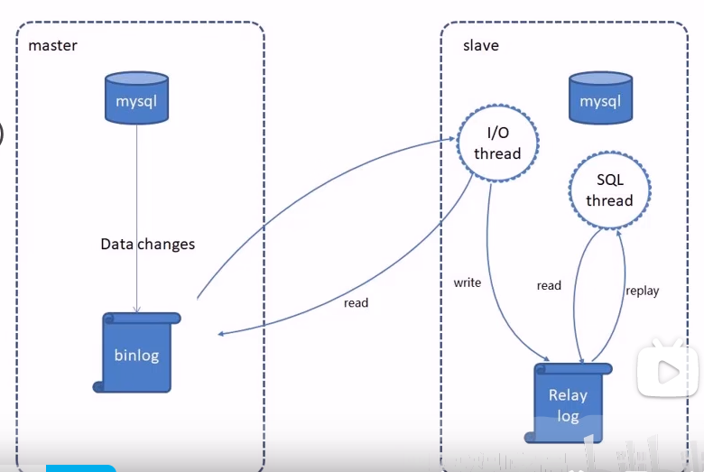
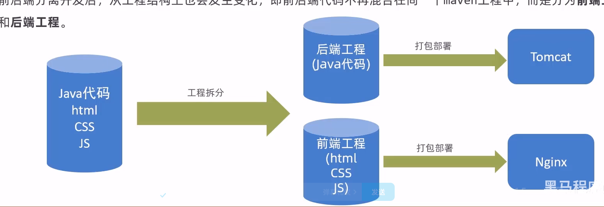
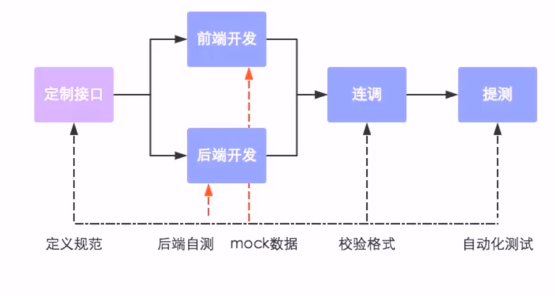

# 1. Redis基础入门

## 1.1 Redis简介

- Redis是一个基于`内存`的key-value结构数据库
- 基于内存存储，其读写性能高，对比于mysql，mysql是存储在磁盘中的，其读写性能较次
- 适合存储热点数据(热点商品、资讯、新闻),短时间内有大量用户来访问的数据
- 常见的可以将Redis作为缓存数据库，作为消息中间件，可以达到每秒10万+的QPS(每秒内查询次数)，它存储的value类型比较丰富，也被称为结构化的NoSql数据库
- NoSql数据库(Not Only SQL):不仅仅是SQL，泛指`非关系型数据库`。NoSql数据库并不是要取代关系型数据库，而是关系型数据库的补充
- 可以用在`缓存`、`任务队列`、`消息队列`、`分布式锁`
- 资料网站:https://www.redis.net.cn/

## 1.2 Linux下使用Redis

- 进入到目录下:` tar -zxvf redis-4.0.0.tar.gz -C /usr/local`
- 下载gcc:`yum install gcc-c++`
- 进入到redis根目录下:`make`
- 进入到redis的src目录,执行安装:`make install`
- Linux中redis服务启动，可以使用`./redis-server`
- 客户端可以通过启动:`./redis-cli`的方式来启用服务
- 修改redis为后台运行,修改conf文件中的dae属性为yes,然后启动时让它显式地来加载文件:` ./redis-server ../redis.conf`
- 将requirepass这一行解除注释，即可启用密码
- ./redis-cli -h localhost -p 6379 表示客户端以此pi和端口登录
- 进入后输入`auth password`即可登录
- 或者是`./redis-cli -h localhost -p 6379 -a password`一步到位
- 接着修改配置文件,将bind 127.0.0.1这个给注释掉，就可以允许其他机器来访问它

## 1.3 数据类型

- Redis存储的是key-value结构的数据,其中key是字符串类型,value有5种常用的数据类型

- 字符串string:普通字符串，常用
  - Redis字符串类型常用命令
  - SET key value(设定指定key的值)
  - GET key(获取指定key的值)
  - SETEX key second value(设定指定key的值，并将key的过期时间设置为second秒)
  - SETNX key value(只有在key不存在的时候才设置key的值，如果key存在则不执行任何操作)
- 哈希hash:适合存储对象
  - HSET key field value 将哈希表key中字段field的值设置为value
  - HGET key field  获取存储在哈希表中指定字段的值
  - HDEL key field 删除存储在哈希表中的指定字段
  - HKEYS key 获取哈希表中所有字段
  - HVALS key 获取哈希表中的所有值
  - HGETALL key 获取哈希表中指定key的所有字段和值
- 列表list:  按照插入顺序排序，可以有重复元素
  - LPUSH key value1 [value2] 将一个值或者多个值插入到列表的头部
  - LRANGE key start stop 获取列表指定范围内的元素
  - RPOP key 移除并获取列表最后一个元素
  - LLEN key 获取列表长度
  - BRPOP key1 [key2] timeout:移出并且获取列表的最后一个元素，如果列表没有元素会阻塞列表直到等待超时或者发现可弹出元素为止，可以拿来做任务队列
- 集合set:无序集合，没有重复元素
  - SADD key member1 [member2] 向集合中添加一个或者多个成员
  - SMEMBERS key 返回集合中的所有成员
  - SCARD key 获取集合的成员数
  - SINTER key1 [key2]:返回给定所有集合的交集
  - SUNION key1 [key2]:返回所有给定集合的并集
  - SDIFF key1 [key2]:返回所有给定集合的差集
  - SREM key member1 [member2] 移除集合中的元素
- 有序集合sorted set:有序集合，没有重复元素，每个元素都会关联一个double类型的分数(socre),redis是通过分数来为集合中的成员进行从小到大的排序，有序集合的成员是唯一的，但分数却可以重复
  - ZADD key score1 [member] [socre2 member2] 向有序集合添加一个或者多个成员，或者更新已经存在成员的分数
  - ZRANGE key start stop [WITHSCORES] :通过索引区间返回有序集合中指定区间内的成员，加上最后一个参数的时候，会返回元素所对应的分数
  - ZINCRBY key increment member 有序集合中对指定成员的分数加上增量increment
  - ZREM key member [member...] 溢出有序集合中的一个或者多个成员

## 1.4 常用命令

- KEYS pattern 查找所有符合给定模式(pattern)的key
- EXISTS key 检查给定key是否存在
- TYPE key 返回key所存储的值的类型
- TTL key 返回给定key的剩余生存时间(TTL,time to lie) 以秒为单位
- DEL key 该命令用于在key存在时删除key

## 1.5 在JAVA中操作Redis

### 1.5.1 Jedis

```java
    public void test(){
        //1.获取连接
        Jedis jedis = new Jedis("localhost",6379);
        //2.执行具体的操作
        jedis.set("username","xiaoming");
        String username = jedis.get("username");//正常键值对的操作
        System.out.println(username);
        jedis.hset("myhash","addr","bj");//哈希字段的操作
        jedis.keys("*");//获取所有
        //3.关闭连接
        jedis.close();
    }
```

### 1.5.2 Spring Data Redis

- 导入jar包

```java
        <!-- https://mvnrepository.com/artifact/org.springframework.data/spring-data-redis -->
        <dependency>
            <groupId>org.springframework.data</groupId>
            <artifactId>spring-data-redis</artifactId>
        </dependency>
```

- SpringDataRedis中提供了一个高度封装的类:RedisTemplate,针对jedis客户端中的大量api进行了归类和封装，将同一类型操作封装为operation接口
  - ValueOperation:简单的K-V操作
  - SetOperations:set类型数据操作
  - ZSetOperations:zset类型数据操作
  - HashOperations:针对map类型的数据操作
  - ListOperations:针对list类型的数据操作

- 配置redis

```yaml
spring:
  application:
    name:sprintdataredis_demo
  redis:
    host: localhost
    port: 6379
    password: 123456
    jedis:
      pool:
        max-active: 8 #最大连接数
        max-wait: 1ms #连接池中最大阻塞等待时间
        max-idle: 4 # 连接池中的最大空闲连接
        min-idle: 0 #连接池中的最小空闲连接
    database: 0 # 0-15 可以根据conf里面的数量来进行配置,现在默认是16个,因此下标是0-15
```

- 修改序列化器使得服务端和客户端的键值同步

```java
@Configuration
public class RedisConfig extends CachingConfigurerSupport {
    @Bean
    public RedisTemplate<Object,Object> redisTemplate(RedisConnectionFactory connectionFactory){
        RedisTemplate<Object,Object> redisTemplate = new RedisTemplate<>();

        //默认的key序列化器为:JdkSerializationRedisSerializer
        redisTemplate.setKeySerializer(new StringRedisSerializer());
        redisTemplate.setHashKeySerializer(new StringRedisSerializer());

        redisTemplate.setConnectionFactory(connectionFactory);
        return redisTemplate;
    }
}
```

- 注意，原本默认的话，传进去redis里面的键值是序列化后的结果，但我们修改了序列化器之后，使得键值保持字符串的形态，传进去之后依然是我们在java代码中设定的key值。 
- 那么显然地，在java中设定的value直接传入redis之后，也是序列化的，但是我们从redis拿到数据之后，还会做一次反序列化，因此拿到的值是和当时设置的值是一样的。

```java
        redisTemplate.opsForValue().set("city","beijing",10, TimeUnit.SECONDS);
        //设置过期的数据,10秒的话该数据过期
```

```java
        //setNx,只有当键值不存在的时候才会去设置这个值
        Boolean aBoolean = redisTemplate.opsForValue().setIfAbsent("city123", "nj");
```

```java
    /**
     * 操作Set类型的数据
     */
    @Test
    public void testSet(){
        SetOperations setOperations = redisTemplate.opsForSet();
        //存值,可以一次存多个
        setOperations.add("myset","a","b","c");
        //取值
        Set myset = setOperations.members("myset");
        for (Object o : myset) {
            System.out.println((String) o);
        }
        //删除成员,可以指定删除某些元素
        setOperations.remove("myset","a","b");
    }
```

```java
    /**
     * 操作List类型的数据
     */
    public void testList(){
        //List放置的话是从右到左的，就是先放的肯定是是在左边
        ListOperations listOperations = redisTemplate.opsForList();
        //从左边存储值(单个)
        listOperations.leftPush("item1","a");
        //从右边存储值(单个)
        listOperations.rightPush("item2","c");
        //从左边存储值,多个
        listOperations.leftPushAll("item3","a","b","c");
        //从右边存储值,多个
        listOperations.leftPushAll("item4","a","b","c");
        //取值
        listOperations.range("item3",0,-1);//-1表示取出所有的值

        //获取列表长度,并模拟从右边删除元素
        Long item3Size = listOperations.size("item3");
        int item3SizeInt = item3Size.intValue();
        for (int i = 0; i < item3SizeInt; i++) {
            Object item3 = listOperations.rightPop("item3");//出队,右边的出去一个元素
            System.out.println((String) item3);
        }
    }
```

```java
    /**
     * 操作Zset(有序集合数据)
     */
    @Test
    private void testZset(){
        ZSetOperations zSetOperations = redisTemplate.opsForZSet();
        //存值,成员按照从小到大排序
        zSetOperations.add("myZset","a",10.0);
        zSetOperations.add("myZset","b",9.0);
        zSetOperations.add("myZset","c",8.0);
        //取值
        Set<String> myZset = zSetOperations.range("myZset", 0, -1);
        for (String s : myZset) {
            System.out.println(s);
        }
        //修改分数,为指定的某个元素,追加得分
        zSetOperations.incrementScore("myZset","b",20.0);
        //删除成员,可以传入多个参数表示批量删除
        zSetOperations.remove("myZset","a","b");
    }
```

```java

    /**
     * 通用操作
     */
    @Test
    public void testCommon(){
        //获取redis中所有的key
        Set<String> keys = redisTemplate.keys("*");
        for (String key : keys) {
            System.out.println(key);
        }
        //判断某个key是否存在
        Boolean myKey = redisTemplate.hasKey("myKey");
        System.out.println(myKey);
        //删除指定的key
        redisTemplate.delete("item3");
        //获取指定key对应的value的数据类型
        redisTemplate.type("item1");
    }
```

# 2. 项目优化:缓存优化

## 2.1 问题说明

- 我们前边所编写的业务功能中，购物车的实现是基于MySql数据库实现的，也就是`用户点餐数据全部放在数据库中，其增删查改的功能全部都是基于MySql所实现的`
- MySql数据库是一个持久化关系型数据库，比较适合用来存储长期使用的数据，购物车中的数据通常都是暂时的，也就是用户只有点餐的时候才会用到，并不需要长时间保留在数据库中，而且每次的更新、删除操作通常是在2-10分钟左右，将购物车数据持久化并且仅仅依靠Mysql数据库来做查询并不划算
- 假设场景:用户数量很多，系统访问量很大，当频繁访问数据库的时候，系统性能就会下降，用户体验会很差，这是因为访问压力全部给到了MySql了，存在性能问题

## 2.2 环境搭建

- 新建新的分支`v1.0`，将代码提交到新的分支上

```shell
git add .
git commit -m "v1.0:缓存优化"
git push --set-upstream origin v1.0
```

- 也可以使用IDEA的可视化工具进行分支创建，注意使用http方式传输
- 导入spring data redis的maven坐标

```xml
        <dependency>
            <groupId>org.springframework.boot</groupId>
            <artifactId>spring-boot-starter-data-redis</artifactId>
        </dependency>
```

- 加入redis相关配置参数

```yaml
  redis:
    host: 
    port: 
    password: 
    database:
```

- 添加redis配置类:序列化器

```java
@Configuration
public class RedisConfig extends CachingConfigurerSupport {
    //该对象是自动创建的,当不存在的时候才会创建@OnMissingBean
    @Bean
    public RedisTemplate<Object,Object> redisTemplate(RedisConnectionFactory connectionFactory){
        RedisTemplate<Object,Object> redisTemplate = new RedisTemplate<>();

        //默认的key序列化器为:JdkSerializationRedisSerializer
        redisTemplate.setKeySerializer(new StringRedisSerializer());
        redisTemplate.setHashKeySerializer(new StringRedisSerializer());

        redisTemplate.setConnectionFactory(connectionFactory);
        return redisTemplate;
    }
}
```

## 2.3 缓存短信验证码

### 2.3.1 实现思路

- 之前所实现的业务功能是这样的:随机生成的验证码保存在HttpSession中，现在需要改造为将验证码缓存在Redis中，实现思路如下:

- 在服务端UserController注入RedisTemplate对象，用于操作redis
- 在服务端UserController的sendMsg方法，将随机生成的验证码缓存到Redis中，设置有效期为5分钟
- 在服务端UserController的login方法中，从Redis中获取缓存的验证码，如果登录成功则删除Redis中的验证码

### 2.3.2 代码改造 

```java
		//将验证码保存到redis中,并且设置有效期为5分钟
		redisTemplate.opsForValue().set(phone,code, 5,TimeUnit.MINUTES);
			
```

```java
        String codeInRedis = (String) redisTemplate.opsForValue().get(phone);
		redisTemplate.delete(phone);
```

## 2.4 缓存菜品数据

### 2.4.1 实现思路

- 前面所实现的业务功能中已经实现了移动端菜品查看功能，此方法会根据前端提交的查询条件进行数据库的查询操作，在高并发的情况下，频繁地查询数据会导致系统性能下降，服务端响应时间增长，现在需要对此方法进行缓存优化，提高系统的性能
- 根据展示的逻辑，当前只需要展示对应的分类所对应的菜品，是根据菜品的分类进行缓存的，因此我们在redis应该是通过分类作为key,期内菜品作为val进行存储
- 改造DishController的list方法，先从Redis中获取菜品数据，如果有则直接返回，无需查询数据库，如果没有则查询数据库，并将查询到的菜品数据放到redis中
- 改造DishController的sava和update方法，加入清理缓存的逻辑
- **在使用缓存过程中，要注意保证数据库中的数据和缓冲中的数据一致，如果数据库中的数据发生变化，需要及时清理缓存数据**
  - 这实际上就是使用缓存时需要注意的一个问题:`脏读`，我们在学习操作系统的时候，当我们将磁盘中的数据页调入内存，假设有一个进程A对数据进行修改了,这时候就产生了一种情况，内存中的数据和磁盘中的数据不一样了，这时候假如有另外一个进程B去读磁盘中对应这一页的数据，读出来使用，用完之后A先写回去，B再写回去，这时候就产生了数据不一致的情况，产生了错误，而且很明显可以感知到，如果写回的顺序不一样，那么产生的结果也不一样。
  - 那么解决办法也是有的，也就是在内存中修改完之后，立马将脏数据写回磁盘，避免数据不一致的问题。 


### 2.4.2 代码改造

```java
        List<DishDto> dishDtos  = null;
        //1.先从redis中缓存数据
        //动态构造key
        String key = "dish_"+dish.getCategoryId()+"_"+dish.getStatus();
        //如果存在,直接返回,无需返回数据库
        dishDtos = (List<DishDto>) redisTemplate.opsForValue().get(key);
        //如果不存在,需要查询数据库,将查询带的菜品数据缓存到redis
        if(dishDtos!=null){
            return dishDtos;
        }
```

```java
        //首次查询数据库,将查询到的缓存到redis
        redisTemplate.opsForValue().set(key,dishDtoes,60, TimeUnit.MINUTES);//缓存60分钟
```

```java
        //清理所有菜品的缓存数据
        //Set keys = redisTemplate.keys("dish_*");
        //redisTemplate.delete(keys);
        //精确清理缓存数据
        
        //只是清理某个分类下面的菜品缓存数据
        String key = "dish_"+dishDto.getCategoryId()+"_1";
        redisTemplate.delete(key);
```

- 只要是涉及到更新数据库中的操作,都需要清理缓存数据，尤其是要注意删除操作，删除操作应该要在它删除之前去把对应的分类id给拿出来，否则会查不到的

## 2.5 Spring Cache

**Spring Cache**是一个框架，实现了基于注解的缓存功能，只需要简单地加一个注解，就能够实现缓存功能

Spring Cache提供了一层抽象，底层可以切换不同的cache实现，具体就是通过**CacheManager**接口来统一不同的缓存技术

CacheManager是Spring提供的各种缓存技术抽象接口

- 注意:这个技术是基于内存的，一旦我们重启了服务，数据就会消失，底层数据结构是一个ConcurrentMap

| 注解           | 说明                                                         |
| -------------- | ------------------------------------------------------------ |
| @EnableCaching | 开启缓存注解功能                                             |
| @Cacheable     | 在方法执行前Spring先查看缓存中是否有数据，如果有数据，则直接返回缓存数据，若没有数据，则调用方法并将方法返回值放到缓存中 |
| @CachePut      | 将方法的返回值放到缓存中                                     |
| @CacheEvict    | 将一条或多条数据从缓存中删除                                 |

```java
//CachePut将方法返回值放入缓存
//value:缓存的名称,每个缓存名称下面可以有多个key
//key:缓存的key,用SpEL表达式来动态计算key
@CachePut(value="userCache",key="#result.id")
//注:result是该方法的返回值
```

```java
//CacheEvict:清除缓存中key所对应的数据
//#root.args[0]获取参数表中的第一个数据
//#result.id:从返回结果中获得id属性值
@CacheEvict(value="userCache",key="")
```

```java
//Cacheable在方法执行前spring会先查看缓存中是否有数据,如果有数据,则直接返回缓存数据,如果没有数据,则会调用方法将方法返回值放到缓存中
//该注解还可以解决缓存穿透(redis和数据库中),体现在当key所对应的val在数据库中并不存在的时候,这时候会将一个空占位数据缓存到缓存中(缓存空对象,可以预防高并发的时候访问不存在的数据,服务端缓存空数据,客户端访问时直接返回空数据)
//condition可以用来指定什么情况下缓存数据,这里给的条件是当查询得到的result不为空的时候才把数据缓存到服务端(但Cacheable没有这个上下文对象)
//unless是除非的意思,也就是除非#result==null的时候就不缓存
//注意:key应该是有唯一格式,用来规定查询何种缓存
@Cacheable(value="userCache",key="",unless = "#result==null")
```

- 导入redis作为底层数据驱动的依赖包

```xml
        <dependency>
            <groupId>org.springframework.data</groupId>
            <artifactId>spring-data-redis</artifactId>
        </dependency>

        <!-- https://mvnrepository.com/artifact/org.springframework.boot/spring-boot-starter-cache -->
        <dependency>
            <groupId>org.springframework.boot</groupId>
            <artifactId>spring-boot-starter-cache</artifactId>
            <version>2.7.2</version>
        </dependency>
```

- 配置application.yml

```yaml
  cache:
    redis:
      time-to-live: 1800000 #设置缓存30分钟过期
```

## 2.6 缓存套餐数据

- 具体的实现思路
  - 导入SpringCache和Redis相关的Maven坐标
  - 在application.yml中配置缓存数据的过期时间
  - 在启动类上加上`@EnableCaching`注解,开启缓存功能
  - 在SetmealController的list 方法上加入`Cacheable`注解
  - 在SetmealController的save和delete方法上加入`CacheEvict`注解

```java
    @GetMapping("/list")
    @Cacheable(value ="setmealCache",key = "#categoryId+'_'+#status")
    public Result<List<SetmealDto>> list(Long categoryId,int status){
        List list = setmealService.getByCategoryId(categoryId,status);
        return Result.success(list);
    }
```

- 在做完这一步之后，会发现报错:`DefaultSerializer requires a Serializable payload but received an object of type`

- 这是因为`要缓存的JAVA对象必须实现Serializable接口，因为Spring会先将对象序列化在存入Redis，将缓存实体类继承Serializable`

```java
public class Result <T> implements Serializable 
```

# 3. 项目优化:读写分离

## 3.1 问题分析

- 目前我们所有的读和写的压力都由一台数据库来承担
- 压力大数据库服务器磁盘损坏则数据丢失，单点故障	



- 如上图所示，要做出来的效果就是将写操作和读操作给分离出来，`写主库，读从库，分别将压力压在不同的数据库上`
- 同时为了使得主库和从库的数据保持一致，我们需要启用Mysql的主从复制

## 3.2 Mysql实现主从复制

### 3.2.1 基本原理介绍

- Mysql主从复制是一个`异步`的复制过程，底层是基于Mysql数据库自带的`二进制日志`功能，就是一台或者多态Mysql数据库(slave,即从库)从另一台MySql数据库(master,即主库)进行日志的复制然后再解析日志并应用到自身，最终实现从库数据和主库的数据保持一致。MySql主从复制是MySql数据库自带功能，而无需借助第三方工具
- MySql复制过程分成三步
  - master将改变记录到二进制日志(binary log)
  - slave将master的binary log拷贝到它的中继日志(relay log)
  - slave重做中继日志中的时间，将改变应用到自己的数据库中



- 在从库中,I/O线程充当生产者线程，它将主库中的binlog读取并且写入relaylog中，而SQL线程充当消费者线程，它从relaylog中读取日志信息，并且执行相应的事件操作

### 3.2.2 配置主从数据库

- 这里笔者准备了两台虚拟机作为主库和从库，分别安装好linux和mysql并且配置好静态ip，要注意把访问端口（3306）给开放出来

- 这里我使用的mysql连接工具是DataGrip,注意一点，在连接的时候记得在url上将`useSSL`这个选项给设置为false，否则会连接失败，如果是使用navicate的话不会有这个问题,这里给两个连接

- https://blog.csdn.net/paincupid/article/details/122745473
- https://blog.csdn.net/JesusMak/article/details/106911908?spm=1001.2101.3001.6650.3&utm_medium=distribute.pc_relevant.none-task-blog-2%7Edefault%7ECTRLIST%7ERate-3-106911908-blog-122745473.t0_searchtargeting_v1&depth_1-utm_source=distribute.pc_relevant.none-task-blog-2%7Edefault%7ECTRLIST%7ERate-3-106911908-blog-122745473.t0_searchtargeting_v1
- 如果使用DataGrip连接有问题的话，请参考以上两篇文章
- 配置主库:
- [第一步] 修改Myusql数据库的配置文件`/etc/my.cnf`

```shell
log_bin=mysql-bin #[必须]启用二进制日志
server-id=128 #[必须]服务器唯一ID,只需要确保其id是唯一的就好
```

- [第二步] 重启Mysql服务

```shell
systemctl restart mysqld
```

- [第三步]登录Mysql数据库,执行下面的SQL

```mysql
grant replication slave on *.* to 'xiaoming'@'%' identified by 'Root@123456';
```

- 上面的SQL的作用是创建一个用户`xiaoming`,密码为`Root@123456`，并且给xiaoming用户授予`replication slave`权限，常用语建立复制时所需要用到的用户权限，也就是slave必须被master授权具有该权限的用户，才能通过该用户复制，这是因为主库和从库之间需要互相通信，处于安全考虑，只有通过验证的从库才能从主库中读取二进制数据
- [第四步]登录Mysql数据库,执行下面的SQL，记录下结果中File和Position的值：`show master status`

```sh
+------------------+----------+--------------+------------------+-------------------+
| File             | Position | Binlog_Do_DB | Binlog_Ignore_DB | Executed_Gtid_Set |
+------------------+----------+--------------+------------------+-------------------+
| mysql-bin.000007 |      154 |              |                  |                   |
+------------------+----------+--------------+------------------+-------------------+

```

- 上面指令的作用是查看Master的状态,执行完此SQL后不要在执行任何操作，如果执行了别的操作的话会使得File和position发生变化
- 配置从库:
- [第一步(这一步和配置主库的是一致的)]修改Myusql数据库的配置文件`/etc/my.cnf`
- [第二步]重启Mysql服务
- [第三步]登录Mysql数据库,执行下面的SQL，参数根据之前的设置灵活调整即可

```mysql
change master to
master_host='192.168.132.128',master_user='xiaoming',master_password='Root@123456',master_log_file='mysql-bin.000007',master_log_pos=154;
start slave;
```

- 如果出现了run Stop错误,则将I/O线程给终止，重新启动即可`stop slave;`

- [第四步]登录Mysql数据库,执行SQL，查看从库的状态

```shell
show slave status;
```

## 3.3 读写分离案例

### 3.3.1 背景

- 面对日益增加的系统访问量，数据库的吞吐量面临着巨大瓶颈。对于同一时刻有大量`并发读`操作和较少`写`操作类型的应用系统来说，将数据库拆分为`主库`和`从库`，主库主要负责处理事务性的增删改操作，从库负责处理查询操作，能够有效的避免由数据更新导致的行锁，使得整个系统的查询性能得到极大改善

### 3.3.2 Sharding-JDBC

- Sharding-JDBC定位为轻量级的JAVA框架，在JAVA的JDBC层提供额外的服务，它使得客户端直连数据库，以jar包形式提供服务，无需额外部署和依赖，可理解为增强版的JDBC驱动，完全兼容JDBC和各种ORM框架
- 使用Sharding-JDBC可以在程序中轻松的实现数据库读写分离
  - 适用于任何基于JDBC的ORM框架
  - 支持任何第三方的数据库连接池
  - 支持任意实现JDBC规范的数据库

```xml
<!-- https://mvnrepository.com/artifact/org.apache.shardingsphere/sharding-jdbc-core -->
<dependency>
    <groupId>org.apache.shardingsphere</groupId>
    <artifactId>sharding-jdbc-spring-boot-starter</artifactId>
    <version>4.0.0-RC1</version>
</dependency>
```

- 使用Sharding-jdbc框架的步骤
  - 导入Maven坐标
  - 在配置文件中配置读写分离规则
  - 在配置文件中配置允许bean定义覆盖配置项

## 3.4 项目实战

- [第一步]导入sql文件,执行sql

- [第二步]git新建分支v1.1并且签出，开始项目优化
- [第三步]导入Sharding-jdbc包

- [第四步]修改yml文件
  - 总结一下这一步，还是有很多坑的
  - 首先就是你的yml文件的缩进一定要对，否则你查半天都不知道哪里有问题，一定要查好缩进，稳妥的话可以一个个自己敲，免得出现奇奇怪怪的错误
  - 第二个就是你的jar包要导对,druid包和Sharding包都是要有Spring的，否则会出错
  - 第三个,勤用Maven的clean功能，尤其是出错之后重新导jar包
  - 第四个,druid版本要到1.2.21以上才行,否则你会发现之前做好的东西全部500异常，原因是LocalDateTime数据类型的不兼容

```yaml
server:
  #tomcat访问端口
  port: 8080
spring:
  main:
    allow-bean-definition-overriding: true
  shardingsphere:
   datasource:
      names:
        master,slave
      # 主数据源
      master:
        type: com.alibaba.druid.pool.DruidDataSource
        driver-class-name: com.mysql.cj.jdbc.Driver
        url: jdbc:mysql://192.168.132.128:3306/reggie?useSSL=false?characterEncoding=utf-8
        username: root
        password: 123456
      # 从数据源
      slave:
        type: com.alibaba.druid.pool.DruidDataSource
        driver-class-name: com.mysql.cj.jdbc.Driver
        url: jdbc:mysql://192.168.132.101:3306/reggie?useSSL=false?characterEncoding=utf-8
        username: root
        password: 123456
    masterslave:
      # 读写分离配置
      load-balance-algorithm-type: round_robin
      # 最终的数据源名称
      name: dataSource
      # 主库数据源名称
      master-data-source-name: master
      # 从库数据源名称列表，多个逗号分隔
      slave-data-source-names: slave
    props:
      sql:
        show: true #开启SQL显示，默认false
  application:
    #非必须项,可以手动指定
    name: reggie
  redis:
    host: 192.168.132.128
    port: 6379
    password: 123456
    database: 0
  cache:
    redis:
      time-to-live: 1800000 #设置缓存30分钟过期
mybatis-plus:
  configuration:
    #在映射实体或者属性时，将数据库中表名和字段名中的下划线去掉，按照驼峰命名法映射
    #这是因为表字段名是用下划线做分割的,而实体类使用驼峰类命名法的
    #address_book->AddressBook
    map-underscore-to-camel-case: true
    log-impl: org.apache.ibatis.logging.stdout.StdOutImpl
  global-config:
    db-config:
      #雪花算法
      id-type: ASSIGN_ID
reggie:
  path: H:/download/
```

# 4. 项目优化:前后端分离





## 4.1 Yapi

- YApi是高效、易用、功能强大的api管理平台，旨在为开发、产品、测试人员提供更优雅的接口管理服务，可以帮助开发者轻松创建、发布、维护API，YApi还为用户提供了优秀的交互体验，开发人员只需要利用平台提供的接口数据写入工具以及简单的点击操作就可以实现接口的管理

## 4.2 Swagger

- 使用Swagger你只需要安装它的规范去定义接口以及接口相关的信息，再通过Swagger衍生出来的一些列项目和工具就可以做到生成各种格式的接口文档，以及在线接口调试页面等

- 使用方式

  - 导入knife4j的maven坐标

  - ```xml
            <dependency>
                <groupId>com.github.xiaoymin</groupId>
                <artifactId>knife4j-spring-boot-starter</artifactId>
                <version>3.0.2</version>
            </dependency>
    ```

  - 导入knife4j相关配置类

  - ```java
    @EnableSwagger2
    @EnableKnife4j
    ```

  - ```java
    @Slf4j
    @Configuration
    @EnableSwagger2
    @EnableKnife4j
    public class WebMvcConfig extends WebMvcConfigurationSupport {
        @Bean
        public Docket createRestApi() {
            // 文档类型
            return new Docket(DocumentationType.SWAGGER_2)
                    .apiInfo(apiInfo())
                    .select()
                    .apis(RequestHandlerSelectors.basePackage("com.example.controller"))
                    .paths(PathSelectors.any())
                    .build();
        }
    
        private ApiInfo apiInfo() {
            return new ApiInfoBuilder()
                    .title("瑞吉外卖")
                    .version("1.0")
                    .description("瑞吉外卖接口文档")
                    .build();
        }
    }
    ```

  - 设置静态资源映射，否则无法访问静态页面

  - ```java
        protected void addResourceHandlers(ResourceHandlerRegistry registry) {
            log.info("静态资源映射到了");
            registry.addResourceHandler("/backend/**").addResourceLocations("classpath:/backend/");//设置要映射哪些访问路径
            registry.addResourceHandler("/front/**").addResourceLocations("classpath:/front/");
            registry.addResourceHandler("doc.html").addResourceLocations("classpath:/META-INF/resources/");
            registry.addResourceHandler("/webjars/**").addResourceLocations("classpath:/META-INF/resources/webjars/");
        }
    ```

  - 在LoginCheckFilter中设置不需要处理的请求路径

  - ```java
            String[] urls = new String[]{
                    "/employee/login",//1.如果人家请求的路径就是来登录的,直接放行
                    "/employee/logout",//2.退出则直接放行
                    "/backend/**",  //关于页面的显示可以交给前端工程师来做,我们要做的是当用户未登录时,屏蔽请求数据的接口
                    "/front/**",
                    "/common/**",
                    "/user/sendMsg",//移动端发送短信
                    "/user/login",//移动端登录
                    "/doc.html",
                    "/webjars/**",
                    "/swagger/resources",
                    "/v2/api-docs"
            };
    ```

    
